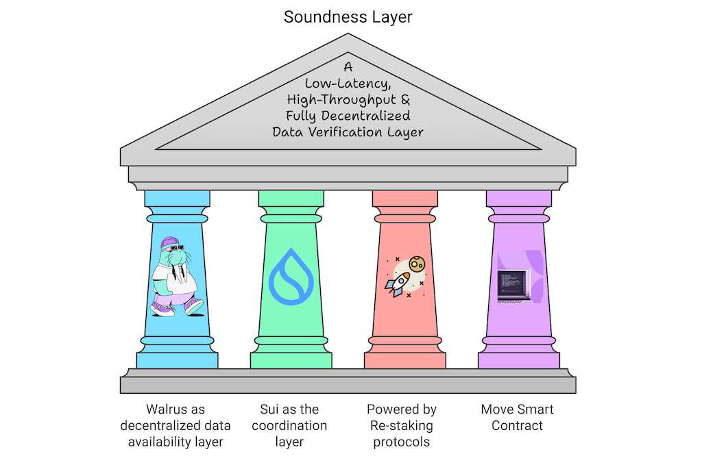

# Soundness Layer



## What has been Modified:

1. Ensure you have rust enviorment(cargo and rustc).
2. Jump to soundness-cli and do cargo run to get target:
```
cd soundness-cli
cargo run
```
3. Jump to target/debug and run the client:
```
cd target/debug
./soundness-cli generate-keys-bulk --count <COUNT>
```
4. Checkout File: key_store.json and key_store_with_mnemonic.json